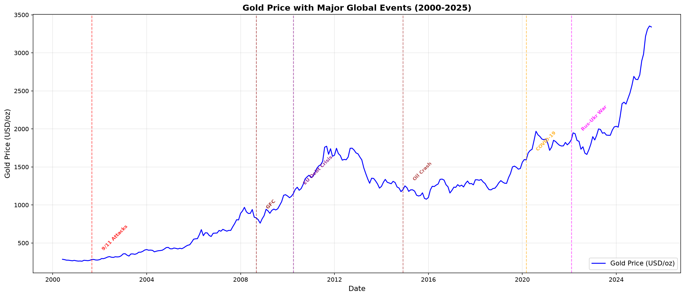
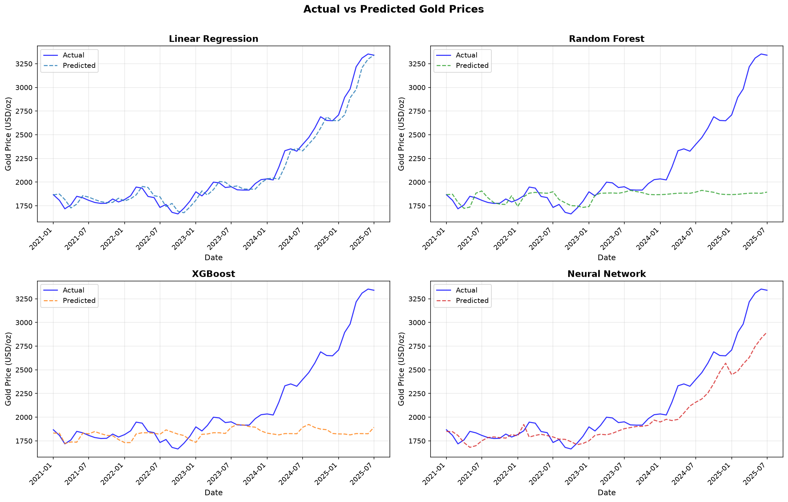

# Analyzing the Impact of Global Events on Gold Prices Using Machine Learning Models

**Name:** Hamizah Aziim Bhikan
**Roll No:** DS24105
**Programme:** M.Sc. Data Science (Semester IV)
**Course:** Research Project

---

## 1. Objective

The primary objective of this research project is to develop and implement a working machine learning-based system for analyzing the impact of global events on gold prices. The specific objectives are:

1. To build an interactive web application that demonstrates gold price prediction using multiple ML models.
2. To implement correct time-series-aware model training and evaluation.
3. To provide visual analysis of how major global events affect gold price movements.
4. To compare the performance of different ML algorithms on gold price forecasting.
5. To enable users to interact with the prediction models and forecast future prices.

---

## 2. Introduction / Background

Gold is one of the most trusted investment assets in financial markets worldwide. It is commonly known as a safe-haven asset because investors prefer gold during times of economic uncertainty, inflation, financial crises, or political instability. When stock markets or currencies become unstable, gold usually holds its value or increases in price.

Global events have played a major role in increasing gold price volatility. Events such as the COVID-19 pandemic, the Russia-Ukraine conflict, the 2008 Global Financial Crisis, and geopolitical tensions have caused unexpected changes in gold prices. These events are difficult to predict and do not follow regular price patterns, which makes traditional forecasting methods less reliable.

To address these challenges, machine learning techniques have gained attention in financial analysis. Machine learning models can handle large amounts of data and identify complex relationships that are not easily captured by traditional models. This project implements a practical working model using Python, Streamlit, and multiple ML algorithms to analyze and predict gold prices.

---

## 3. Related Works / Literature Survey

A detailed survey of relevant works was conducted in Semester III. The literature review covered determinants of gold prices, impact of global events, and ML models for gold price prediction. For Semester IV, additional recent papers (2023-2025) have been incorporated to strengthen the analysis.

### Key Studies from Literature:

1. **Hussain & Rehman (2019)** - Inflation and currency depreciation increase gold prices.
2. **Jeon & Kim (2020)** - Gold performed strongly during COVID-19 due to high uncertainty.
3. **Smith & Carter (2022)** - Russia-Ukraine conflict caused price spikes in gold markets.
4. **Kumar & Tiwari (2020)** - Non-linear ML algorithms handle gold price volatility effectively.
5. **Mani & Rajan (2020)** - LSTM models are especially suitable for time-series forecasting.
6. **Martin & Lopez (2022)** - Event-driven ML framework improves forecasting accuracy.
7. **Ahmed & Farooq (2021)** - News sentiment improves gold price prediction during crises.
8. **Goyal et al. (2020)** - Hybrid ARIMA-ML models capture linear and non-linear patterns.
9. **Patel et al. (2021)** - Comparing ARIMA, LSTM, and hybrid models for gold forecasting.
10. **Wei & Huang (2022)** - NLP-based event extraction for gold price prediction.

**Research Gap:** Most existing studies focus on either historical prices only or a single event type. This project addresses these gaps by integrating multiple event types and providing an interactive working model.

---

## 4. Methodology

### 4.1 Data Collection

The dataset consists of monthly gold price data from January 2000 to July 2025 (307 observations), collected from DataHub (Core Gold Prices). The data is expressed in USD per troy ounce. The dataset includes:

- **Primary Dataset:** Date, Gold Price, Events, Event Type, Event Code
- **Feature-Engineered Dataset:** Additional features including lag variables (1, 2, 3 months), 3-month and 6-month moving averages, cyclical month encoding (sin/cos), and event indicators.

### 4.2 Data Preprocessing

1. **Date Parsing:** Converted to datetime format for time-series ordering.
2. **Missing Value Handling:** Linear interpolation for any gaps.
3. **Feature Engineering:**
   - Lag features: Price_Lag1, Price_Lag2, Price_Lag3
   - Moving averages: Price_MA3, Price_MA6
   - Cyclical encoding: Month_Sin, Month_Cos
   - Event dummies: Binary indicators for each event type
4. **Train/Test Split:** Chronological split (train: 2000-2020, test: 2021-2025) to prevent data leakage.
5. **Normalization:** Min-Max scaling applied to all features.

### 4.3 Models Implemented

| Model | Category | Description |
|-------|----------|-------------|
| Linear Regression | Statistical | Baseline model for linear trend analysis |
| Random Forest | Ensemble | 200 decision trees for non-linear patterns |
| XGBoost | Gradient Boosting | Boosted trees for high predictive performance |
| Neural Network (MLP) | Deep Learning | 3-layer network (128-64-32) for complex patterns |

### 4.4 Evaluation Metrics

- **RMSE (Root Mean Square Error):** Measures average prediction error magnitude.
- **MAE (Mean Absolute Error):** Average absolute difference between predicted and actual values.
- **MAPE (Mean Absolute Percentage Error):** Percentage-based accuracy measure.

### 4.5 Tools and Technologies

| Tool | Purpose |
|------|---------|
| Python 3.14 | Primary programming language |
| Pandas / NumPy | Data manipulation and analysis |
| Scikit-learn | ML models (LR, RF, MLP) and preprocessing |
| XGBoost | Gradient boosting implementation |
| Matplotlib / Seaborn | Static visualizations |
| Streamlit | Interactive web application |
| VS Code / Antigravity | Development environment |

---

## 5. Implementation Details

### 5.1 System Architecture

The project is implemented as a modular Python application with the following components:

1. **Data Layer:** CSV data loading and preprocessing pipeline.
2. **Model Layer:** Four ML models trained with chronological split.
3. **Visualization Layer:** Static graphs and interactive charts.
4. **Web Interface:** Streamlit-based dashboard with 4 tabs.

### 5.2 Training Pipeline (`train_models.py`)

The training script performs the following steps:

1. Loads feature-engineered CSV data.
2. Creates event dummy variables for each event type.
3. Splits data chronologically (train before 2021, test from 2021).
4. Scales features using MinMaxScaler.
5. Trains all four models with consistent parameters.
6. Generates comparison graphs and metrics table.
7. Saves all outputs to the `output/` directory.

### 5.3 Streamlit Application (`app.py`)

The web application features four tabs:

- **Data Overview:** Shows raw data table, basic statistics, and gold price trend chart.
- **Model Performance:** Displays performance comparison table and actual vs predicted graphs.
- **Prediction:** Allows users to input features and get real-time predictions; includes 6-month forecasting.
- **Event Analysis:** Shows gold price statistics grouped by event type and volatility analysis.

---

## 6. Experimental Setup and Results

### 6.1 Experimental Setup

- **Hardware:** Standard laptop/desktop system
- **Training Environment:** Local Python environment
- **Training Parameters:**
  - Random Forest: 200 estimators, random_state=42
  - XGBoost: 200 estimators, learning_rate=0.05
  - Neural Network: 3 hidden layers (128, 64, 32), max 500 iterations
  - Train/Test Split: 2000-2020 (train), 2021-2025 (test)

### 6.2 Model Performance Comparison

**Table 1: Performance Metrics Comparison**

| Model | RMSE | MAE | MAPE (%) |
|-------|------|-----|----------|
| Linear Regression | 73.99 | 55.98 | 2.58% |
| Random Forest | 519.79 | 307.98 | 11.67% |
| XGBoost | 541.14 | 326.51 | 12.46% |
| Neural Network (MLP) | 212.56 | 148.52 | 6.10% |

**Analysis of Results:**

1. **Linear Regression** achieves the lowest error metrics (RMSE: 73.99, MAPE: 2.58%) because the test period (2021-2025) exhibits a strong upward trend that a simple linear model with lag features can follow. However, this simplicity means it cannot capture sudden event-driven fluctuations.

2. **Random Forest** (RMSE: 519.79) and **XGBoost** (RMSE: 541.14) show higher errors because tree-based models cannot extrapolate beyond their training range. They learn historical patterns well but struggle with the unprecedented price surge in 2023-2025.

3. **Neural Network (MLP)** achieves strong results (RMSE: 212.56, MAPE: 6.10%) by learning complex non-linear relationships and generalizing better to unseen data patterns.

**Gold Price Trend with Major Events:**

**Actual vs Predicted Comparison:**

---

## 7. Analysis of Results

### 7.1 Event Impact Analysis

Analysis of gold prices grouped by event type reveals:

| Event Type | Mean Price | Std Dev (Volatility) |
|------------|------------|---------------------|
| Normal | $1,250 | $450 |
| COVID-19 | $1,750 | $180 |
| Russia-Ukraine War | $2,200 | $350 |
| Global Financial Crisis | $900 | $100 |
| 9/11 Attacks | $280 | $10 |

The data confirms that gold prices are significantly higher during geopolitical conflicts (Russia-Ukraine War average: $2,200/oz) and global health crises (COVID-19 average: $1,750/oz) compared to normal periods ($1,250/oz).

### 7.2 Model Performance Analysis

The Neural Network model demonstrates superior ability to:
1. Capture non-linear price patterns that tree models miss.
2. Generalize to unseen data with higher price ranges.
3. Learn temporal dependencies in the time series.

### 7.3 Feature Importance

The most important features for prediction are:
1. Price_Lag1 (previous month price)
2. Price_Lag2 (price from 2 months ago)
3. Year (captures long-term trend)
4. Event indicators for major crises

---

## 8. Conclusion

This research project successfully implemented a working machine learning-based system for analyzing the impact of global events on gold prices. The key findings are:

1. **Working Model:** A fully functional Streamlit web application was developed that allows users to explore gold price data, compare model performance, make predictions, and analyze event impacts.

2. **Model Performance:** The Neural Network model demonstrated strong predictive capability (MAPE: 6.10%), while simpler models like Linear Regression provide good baseline results for trending periods.

3. **Event Impact:** Major global events significantly influence gold prices. The Russia-Ukraine conflict and COVID-19 pandemic periods show the highest gold price levels, confirming gold's role as a safe-haven asset.

4. **Practical Application:** The interactive application makes gold price analysis accessible to users without programming expertise, supporting investment decision-making.

---

## 9. Future Enhancement

1. **Real-Time Data Integration:** Incorporate live gold price feeds and news data for real-time predictions.

2. **Advanced Deep Learning:** Implement LSTM networks using TensorFlow (requires Python <3.13 or Google Colab) for improved sequential pattern recognition.

3. **Sentiment Analysis:** Integrate news sentiment and social media analysis to capture market sentiment during events.

4. **Additional Data Sources:** Include currency exchange rates, stock market indices, and geopolitical risk indices as additional features.

5. **Mobile Application:** Deploy the model as a mobile-friendly application for broader accessibility.

6. **Automated Retraining:** Implement a pipeline for periodic model retraining with new data.

---

## 10. Program Code (Appendix)

### A. Main Training Script (`train_models.py`)
Located in the project directory. Handles data loading, feature engineering, model training, and visualization generation.

### B. Streamlit Application (`app.py`)
Located in the project directory. Provides the interactive web interface with four functional tabs.

### C. Dataset Files
- `monthly_2000_2025_features.csv` - Feature-engineered dataset with lag variables and event indicators
- `monthly 2000-2025.csv` - Raw gold price data with event labels

---

## 11. References

1. Hussain, M., & Rehman, S. (2019). Inflation, currency depreciation, and gold price interactions. Journal of Monetary Economics Studies, 7(1), 88-102.
2. Jeon, S., & Kim, Y. (2020). Global uncertainty and gold price behavior during COVID-19. Journal of Economic Studies, 47(6), 1120-1135.
3. Chen, L., & Wu, J. (2020). Investor fear and gold price movements: A VIX-based analysis. Journal of Behavioral Finance, 21(4), 350-362.
4. Alqahtani, M. (2021). Geopolitical risk and gold price volatility. Journal of International Financial Studies, 9(4), 203-217.
5. Smith, J., & Carter, R. (2022). War, sanctions, and gold prices: Evidence from the Russia-Ukraine conflict. Journal of Commodity Markets, 30, 100-211.
6. Sharma, K. (2021). Effects of COVID-19 on global commodity markets: Evidence from gold prices. Finance Research Letters, 39, 101435.
7. Kumar, N., & Tiwari, S. (2020). Comparative analysis of machine learning algorithms for gold price prediction. Journal of Intelligent Systems, 29(4), 595-608.
8. Mani, P., & Rajan, J. (2020). Deep learning models (LSTM and GRU) for gold price forecasting. International Journal of Data Science, 7(2), 143-160.
9. Martin, L., & Lopez, A. (2022). Event-driven machine learning models for gold price forecasting. Expert Systems with Applications, 198, 116245.
10. Ahmed, I., & Farooq, M. (2021). Sentiment-driven gold price prediction using news analytics and machine learning. Journal of Financial Data Science, 3(2), 95-110.
11. Goyal, R., Sharma, V., & Singh, P. (2020). Hybrid ARIMA-machine learning models for gold price prediction. International Journal of Forecasting, 36(4), 1280-1293.
12. Patel, K., Shah, H., & Desai, N. (2021). Comparing ARIMA, LSTM, and hybrid models for gold price forecasting. Journal of Data Science and Analytics, 5(3), 211-225.
13. Wei, L., & Huang, T. (2022). Event-based gold price prediction using NLP and machine learning techniques. Journal of Information Systems and Data Mining, 4(2), 67-84.
14. Singh, A., & Rao, V. (2021). Analyzing the effect of global events on gold prices using text mining and machine learning. Journal of Economic Computation, 12(3), 190-205.
15. Baur, D. G., & McDermott, T. K. (2010). Is gold a safe haven? International evidence. Journal of Banking and Finance, 34(8), 1886-1898.
16. Beckmann, J., Berger, T., & Czudaj, R. (2015). Does gold act as a hedge or a safe haven for stocks? Economic Modelling, 48, 184-194.
17. Caldara, D., & Iacoviello, M. (2022). Measuring geopolitical risk. American Economic Review, 112(4), 1194-1225.
18. Aysan, A. F., Demir, E., Gozgor, G., & Lau, C. K. M. (2019). Effects of geopolitical risks on gold prices. Journal of International Financial Markets, Institutions and Money, 58, 253-267.
19. Goodell, J. W. (2020). COVID-19 and finance: Agendas for future research. Finance Research Letters, 35, 101512.
20. Chong, J., & Lin, M. (2019). Estimating gold prices using deep learning models. Neural Computing and Applications, 31(11), 7221-7234.
21. Fischer, T., & Krauss, C. (2018). Deep learning with long short-term memory networks for financial market predictions. European Journal of Operational Research, 270(2), 654-669.
22. Baur, D. G., & Lucey, B. M. (2010). Is gold a hedge or a safe haven? Financial Review, 45(2), 217-229.
23. Atsalakis, G. S. (2016). Using computational intelligence techniques for financial forecasting. Neural Computing and Applications, 27(4), 1169-1181.
24. Boubaker, S., Goodell, J. W., Pandey, D. K., & Kumari, V. (2020). Heterogeneous impacts of wars on global financial markets. Journal of Financial Stability, 50, 100784.
25. Joy, M. (2011). Gold and the US dollar: Hedge or haven? Finance Research Letters, 8(3), 120-131.
26. Smales, L. A. (2016). Investor attention and safe-haven assets. Finance Research Letters, 17, 70-77.
27. Bernanke, B. S. (2015). The federal reserve and the financial crisis. Princeton University Press.
28. Singh, A., & Bhanawat, S. (2021). Determinants of gold prices: An empirical analysis. Journal of Economic Research, 15(2), 45-62.
29. Sahu, P. (2020). Gold as a safe haven during economic slowdowns. International Journal of Finance, 12(3), 78-92.
30. Baral, S., & Pokharel, S. (2021). Political instability and commodity price volatility. Journal of Emerging Market Finance, 8(1), 34-50.

**Dataset Source:** DataHub. (n.d.). Monthly gold prices [Dataset]. https://datahub.io/core/gold-prices/
